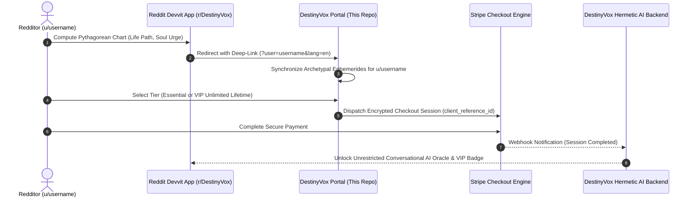

# 🌌 DestinyVox — AI Oracle Portal & Pythagorean Hermetic Intelligence

<p align="center">
  
  
  
  
  
  
</p>

---

## 📌 Ecosystem & Portal Overview

**DestinyVox** is an immersive esoteric AI platform bridging ancient Pythagorean numerology, Hermetic archetypes, and cutting-edge artificial intelligence. 

This repository houses the **DestinyVox Web Portal & Stripe Checkout Gateway**, specifically engineered as the high-conversion monetization and onboarding frontend for the native **Reddit Devvit App (`r/DestinyVox`)**. When redditors calculate their natal numerological coordinates on Reddit, this gateway receives contextual query telemetry (Reddit handle, selected locale, and subscription tier), synchronizes their archetypal ephemerides, and provisions immediate access to conversational AI Oracle sessions upon checkout completion.

---

## 🏛️ Ecosystem Architecture & Cross-Platform Flow



---

## ✨ Key Capabilities & Architectural Highlights

### 1. 🔄 Context-Aware Reddit Deep Linking
- **Automatic Identity Detection:** Seamlessly extracts `u/{username}` from query strings (`?user=`, `?reddit_user=`) and binds payment records to Reddit account identifiers.
- **Dynamic Personalized UI:** Greets initiated users with personalized cosmic sync status banners (`"EPHEMERIDES & ORACLE SYNCHRONIZED FOR: u/username"`).

### 2. 🌐 Trilingual Localization Engine (i18n)
- **Zero-Dependency Native Switching:** Real-time localized runtime supporting **English (EN)**, **Portuguese (PT)**, and **Spanish (ES)**.
- **Localized Value Propositions:** Culturally tuned messaging for esoteric inquiries, astrological/numerological terminology, and multi-currency pricing formats (USD / BRL).

### 3. 🔮 The Pythagorean Archetypal Framework
The platform bridges 5 primary cosmic pillars calculated by the DestinyVox engine:
- **Life Path (Caminho de Vida):** Core trajectory, evolutionary mission, and life lessons.
- **Destiny / Expression (Expressão Cósmica):** Latent gifts, intellectual capabilities, and vocations.
- **Soul Urge / Motivation (Desejo da Alma):** Internal drives, emotional truth, and private desires.
- **Personality (Personalidade Externa):** Social aura, perception, and initial impact on others.
- **Personal Year Cycle (Ano Pessoal 1–9):** Strategic micro-forecasts and high-leverage timing windows.

### 4. 💳 Frictionless Stripe Monetization
- **Tier 1 — Essential Oracle:** One-time access providing 50 deep consultations, strategic 12-month Personal Year forecasts, and 360° Archetypal Dossier.
- **Tier 2 — VIP Unlimited Lifetime:** Unrestricted AI dialogues, priority archetypal deep-reasoning, Hermetic synastry cross-matching with other Reddit users, and the golden Initiate flair in `r/DestinyVox`.
- **State-Preserving Checkout Handoff:** Formats Stripe Checkout links dynamically with `client_reference_id`, user locale, and selected price identifiers.

### 5. 🎨 Brutalist & Dark Cosmic Aesthetics
- Ultra-austere color palette (`#040404` deep black, crisp `#f5f5f5` typography, amber-gold accents).
- Built on top of **Tailwind CSS v4** engine with pure CSS typography tracking, hairline borders, and subtle glow effects without heavy runtime asset penalties.

---

## 🛠️ Tech Stack Breakdown

| Layer | Technology | Details |
|---|---|---|
| **Core UI Framework** | [React 19](https://react.dev/) | React 19 concurrent features and reactive state hooks |
| **Build & Tooling** | [Vite 8](https://vite.dev/) | Sub-second HMR and production bundle minification |
| **Language** | [TypeScript 6](https://www.typescriptlang.org/) | Strict type definitions across translations and pricing entities |
| **CSS Engine** | [Tailwind CSS v4](https://tailwindcss.com/) | Next-generation CSS framework leveraging `@tailwindcss/vite` |
| **Iconography** | [Lucide React](https://lucide.dev/) | Featherlight SVG symbols (Sparkles, Shield, Lock, Arrows) |
| **Linter** | [oxlint](https://oxc.rs/) | Ultra-fast Rust-based static code analysis |
| **Payment Protocol** | Stripe Checkout API | Hosted PCI-compliant checkout sessions with metadata pass-through |
| **Companion Ecosystem** | Reddit Devvit Web Platform | Hermetic numerology app on Reddit |

---

## 📂 Repository Structure

```
destinyvox/
├── public/
│   ├── favicon.svg          # Mystical sigil icon
│   └── icons.svg            # Vector symbol sets
├── src/
│   ├── assets/
│   │   └── hero.png         # Archetypal hero imagery
│   ├── App.css              # Custom styling definitions
│   ├── App.tsx              # Main interactive portal application & checkout router
│   ├── index.css            # Tailwind v4 configuration & base layer directives
│   └── main.tsx             # Vite application bootstrap
├── index.html               # Semantic HTML5 entrypoint with preconnect hints
├── package.json             # Dependencies and build script targets
├── tsconfig.json            # Base TypeScript project configuration
├── tsconfig.app.json        # Frontend application compiler options
└── vite.config.ts           # Vite + Tailwind v4 + React plugin settings
```

---

## 🚀 Getting Started

### Prerequisites
- Node.js 20+
- npm or pnpm

### Quickstart

```bash
# 1. Clone repository
git clone https://github.com/felipedutrag/destinyvox.git
cd destinyvox

# 2. Install dependencies
npm install

# 3. Start local development server
npm run dev
```

### URL Testing Parameters

To preview the portal in different localized and contextual states:

```
# English view with encrypted token from Devvit app
http://localhost:5173/?ref=enc_...&lang=en

# Portuguese view with plain username
http://localhost:5173/?user=AstroMistico&lang=pt

# Spanish view with prompt modal triggered on checkout if no param
http://localhost:5173/?lang=es
```

### Environment Variables (.env)

The portal automatically switches Stripe links based on environment:

- **Local Development / Sandbox**: `.env.development` or `.env.local`
- **Production Deployment**: `.env.production`

```env
# Stripe Payment Links
VITE_STRIPE_LINK_ESSENTIAL=https://buy.stripe.com/test_... # or live link in prod
VITE_STRIPE_LINK_VIP=https://buy.stripe.com/test_...       # or live link in prod
```

### Production Build & Linting

```bash
# Run oxlint static analysis
npm run lint

# Compile production bundle
npm run build

# Preview production build locally
npm run preview
```

---

## 👤 Author

**Felipe Dutra**  
- **GitHub:** [@felipedutrag](https://github.com/felipedutrag)  
- **Email:** [felipedutra@outlook.com](mailto:felipedutra@outlook.com)
